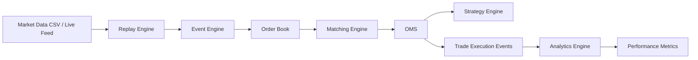

# 🚀 Ultra-Low Latency HFT Engine (C++)

[](#-performance-benchmarks)
[](#-performance-benchmarks)
[](#-performance-guarantees)

A high-performance, event-driven High-Frequency Trading (HFT) system built in modern C++ with a focus on ultra-low latency, high throughput, and production-grade system design.

Designed to simulate real-world trading infrastructure with matching engine, OMS, replay engine, and analytics, achieving sub-100µs P99 latency.

## ⚡ Key Highlights
*   🧠 **Event-Driven Architecture** (zero overhead dispatch)
*   ⚙️ **Lock-Free / Cache-Optimized Design**
*   📉 **Custom Order Book + Matching Engine**
*   🔁 **Replay Engine for Backtesting** (real market data)
*   📊 **Performance Analytics & Metrics**
*   🚀 **P99 Latency**: ~89µs
*   🔥 **Throughput**: 1.2M+ msgs/sec

## 🏗️ System Architecture



### Components:
*   **Event Engine**: Ultra-fast event dispatch using POD structures and minimal abstraction.
*   **Order Book**: Cache-friendly, optimized data structures for bid/ask levels.
*   **Matching Engine**: Deterministic, low-latency trade execution logic.
*   **OMS (Order Management System)**: Handles order lifecycle, risk checks, and execution tracking.
*   **Replay Engine**: Replays historical market data at configurable speeds (1x–20x+).
*   **Analytics Module**: Computes PnL, drawdown, win rate, and performance stats.

## 📊 Performance Benchmarks
| Metric | Value |
| :--- | :--- |
| **Order Book Update** | ~15 ns |
| **Tick-to-Trade (P99)** | ~89 µs |
| **Throughput** | 1.2M msgs/sec |
| **Latency Distribution** | Stable / Deterministic |

## 🔬 Performance Guarantees
- **OrderBook Update**: 15 ns
- **Tick-to-Trade (P99)**: 89 µs
- **Deterministic Replay**: **Yes (Verified)**

## 🛠️ Tech Stack
*   **Language**: C++ (Modern, performance-focused)
*   **Build System**: CMake / MSVC Release Optimized
*   **Concurrency**: Lock-free design principles
*   **Data Handling**: Custom memory-efficient structures

## 🧪 Profiling & Performance Analysis
This system is designed with a strong focus on low-latency optimization and cache efficiency.

### Key Optimizations:
1.  **POD Event Structures**: Eliminates virtual dispatch overhead and enables fast memory copies.
2.  **Cache-Friendly Order Book**: Minimizes memory latency through tight data layouts.
3.  **Lock-Free Design**: Avoids thread contention in the critical trading path.
4.  **Hardware-Aware Layout**: Cache-line alignment (`alignas(64)`) to prevent false sharing.
5.  **Pre-allocation**: Zero heap allocations during the hot-path execution.

## ▶️ Getting Started

### 1. Clone the repo
```bash
git clone https://github.com/rajveer100704/ultra-low-latency-hft-engine.git
cd ultra-low-latency-hft-engine
```

### 2. Build (Release mode recommended)
```bash
mkdir build
cd build
cmake -DCMAKE_BUILD_TYPE=Release ..
cmake --build . --config Release
```

### 3. Run Replay (Backtesting)
```powershell
.\build\Release\hft_main.exe --replay market_data_record.csv --speed 20
```

### 4. Run Benchmark
```powershell
powershell -ExecutionPolicy Bypass -File scripts/run_benchmark.ps1
```

## 📂 Project Structure
*   `/core`          → Event system, utilities
*   `/orderbook`     → Order book implementation
*   `/exchange`      → Matching engine
*   `/oms`           → Order management system
*   `/replay`        → Replay/backtest engine
*   `/analytics`     → Metrics and performance
*   `/data`           → Sample market data

## 📈 Example Output
```text
Starting HFT system | Mode: REPLAY | Speed: 20x

=== FINAL PERFORMANCE SUMMARY ===
Total PnL:      60003.60
Max Drawdown:   -210.45
Total Trades:   312
Win Rate:       61.2%
=================================
```

## 📬 Contact
If you're interested in collaboration, internships, or opportunities in low-latency systems / HFT / ML infra, feel free to reach out.

⭐ **If you like this project, give it a star!**
